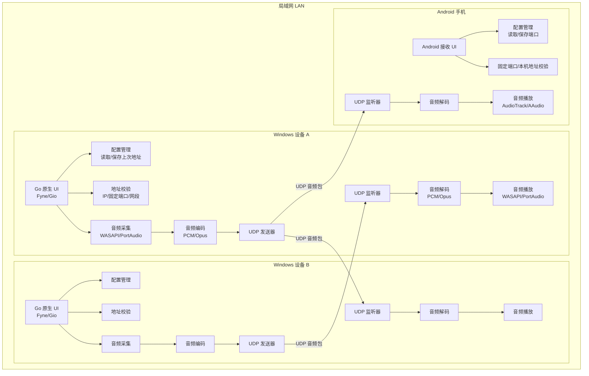
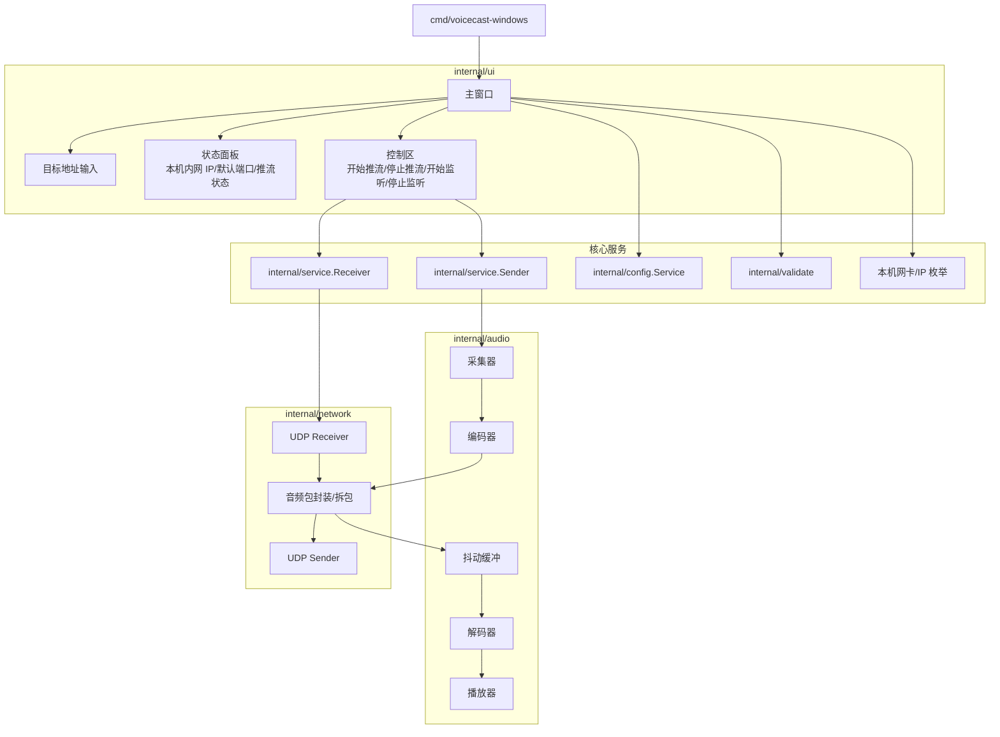
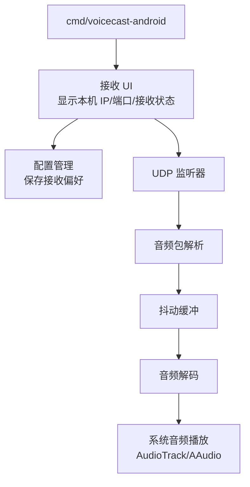
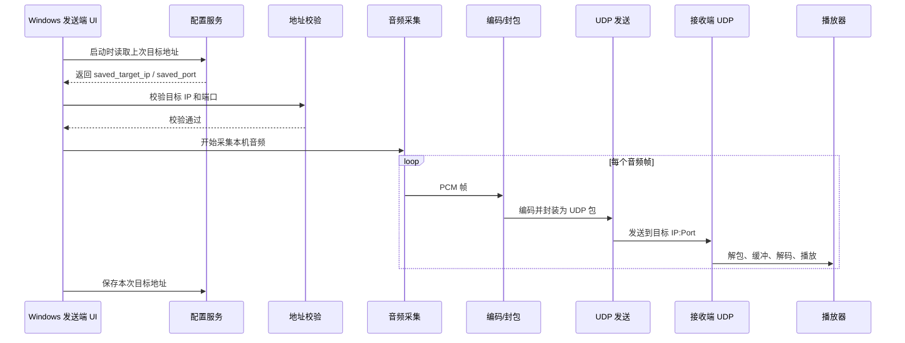
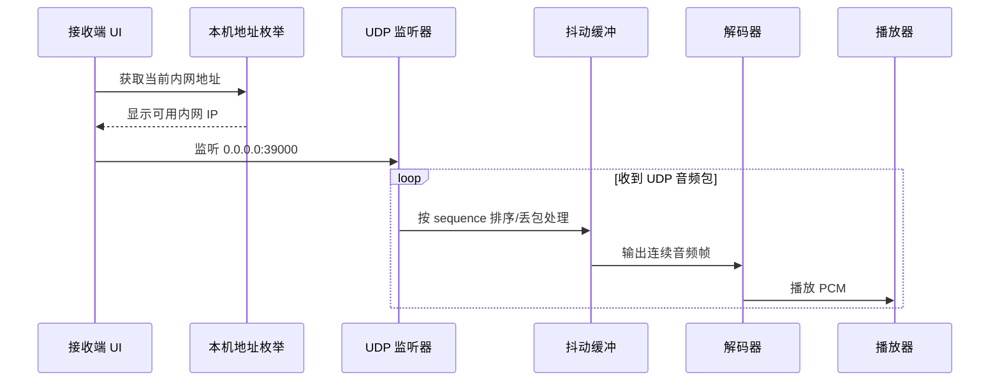
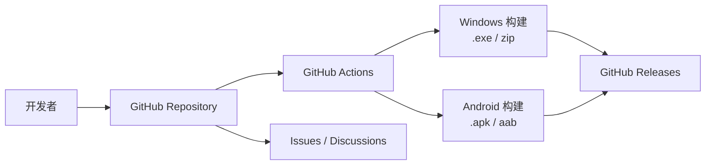

# VoiceCast 软件架构图

## 总体架构



## Windows 客户端模块



## Android 接收端模块



## 推流数据流



## 接收数据流



## UDP 音频包协议

首版建议使用简单二进制包头，便于 Go 和 Android 两端解析。

```text
0               8              16              24              32
+---------------+---------------+---------------+---------------+
| Magic "LAUD"                  | Version       | Codec         |
+---------------+---------------+---------------+---------------+
| Sequence Number                                               |
+---------------------------------------------------------------+
| Timestamp                                                     |
+---------------------------------------------------------------+
| Sample Rate   | Channels      | Frame Duration | Payload Size |
+---------------+---------------+---------------+---------------+
| Payload ...                                                   |
+---------------------------------------------------------------+
```

字段建议：

| 字段 | 说明 |
| --- | --- |
| Magic | 固定 `LAUD`，用于过滤非本协议 UDP 包 |
| Version | 协议版本，首版为 `1` |
| Codec | `0=PCM`，`1=Opus` |
| Sequence Number | 包序号，用于发现丢包和乱序 |
| Timestamp | 采集时间戳或音频帧时间戳 |
| Sample Rate | 采样率，例如 `48000` |
| Channels | 声道数，例如 `1` 或 `2` |
| Frame Duration | 单帧时长，建议 `10ms` 或 `20ms` |
| Payload Size | 音频负载长度 |
| Payload | 编码后的音频数据 |

## 配置文件设计

Windows 配置文件建议存放在：

```text
%APPDATA%\VoiceCast\config.json
```

Android 配置文件使用应用私有目录。

示例：

```json
{
  "last_target_ip": "192.168.1.25",
  "listen_port": 39000,
  "sample_rate": 48000,
  "channels": 2,
  "codec": "pcm",
  "auto_listen": false
}
```

启动流程：

1. 读取配置文件。
2. 配置不存在时写入默认配置。
3. 校验 `last_target_ip` 和默认端口。
4. 校验失败时清空无效目标地址，并在 UI 中提示。
5. 枚举本机网卡，显示当前可用内网地址。

## 地址有效性判定

目标地址只让用户输入 `IP`。端口由程序固定为 `39000`，避免用户输入错误端口。

校验规则：

- IP 必须能被 `net.ParseIP` 解析。
- IP 不能是空值、`0.0.0.0`、`127.0.0.1`、广播地址或组播地址。
- IP 应优先限制在 RFC1918 私有网段：
  - `10.0.0.0/8`
  - `172.16.0.0/12`
  - `192.168.0.0/16`
- 固定默认端口：`39000`。
- 可选增强：判断目标 IP 是否和本机任一内网 IP 处于同一子网。

Go 校验示例：

```go
func ValidateTarget(ipText string, port int) error {
    ip := net.ParseIP(ipText)
    if ip == nil {
        return errors.New("invalid ip address")
    }
    if ip.IsLoopback() || ip.IsUnspecified() || ip.IsMulticast() {
        return errors.New("ip address is not a valid LAN target")
    }
    if !ip.IsPrivate() {
        return errors.New("ip address must be a private LAN address")
    }
    if port < 1 || port > 65535 {
        return errors.New("invalid port")
    }
    return nil
}
```

## Windows UI 页面结构

建议主界面保持一个窗口即可：

```text
+------------------------------------------------+
| VoiceCast                                      |
+------------------------------------------------+
| 本机内网地址                                   |
| 192.168.1.10                                   |
| 默认端口: 39000       [开始监听] [停止监听]     |
+------------------------------------------------+
| 推送到设备                                     |
| 目标 IP: [192.168.1.25]  推送端口: 39000       |
| [开始推流] [停止推流]                          |
+------------------------------------------------+
| 状态                                           |
| 当前状态、丢包率、码率、最后接收时间            |
+------------------------------------------------+
```

UI 行为：

- 启动时自动填充上次保存的目标 IP 和端口。
- 输入框失焦或点击开始推流时进行校验。
- 校验失败时禁用开始推流按钮或显示错误信息。
- 点击开始推流成功后保存目标地址。
- 监听模式和推流模式可以独立开启，使 Windows 同时支持收和发。

## GitHub 开源发布架构



建议开源配套文件：

| 文件 | 用途 |
| --- | --- |
| `LICENSE` | 开源协议，建议 MIT 或 Apache-2.0 |
| `README.md` | 项目介绍、截图、快速开始 |
| `docs/architecture.md` | 架构图和模块设计 |
| `CONTRIBUTING.md` | 贡献指南 |
| `.github/workflows/release.yml` | 自动构建 Windows 和 Android 产物 |
| `.gitignore` | 忽略构建产物、临时文件和本地配置 |

## 推荐开发阶段

1. Windows CLI 原型：实现 UDP PCM 发送和接收播放。
2. Windows UI：加入 Go 原生 UI、地址显示、配置文件、校验。
3. 抖动缓冲：改善 UDP 乱序和短时抖动。
4. Android 接收端：实现 UDP 接收和播放。
5. 编解码优化：从 PCM 切换或扩展到 Opus，降低带宽占用。
6. 发布工程：GitHub Actions 构建 Windows 可执行文件和 Android 安装包。

## 关键风险

| 风险 | 说明 | 建议 |
| --- | --- | --- |
| Windows 系统声音采集 | 采集扬声器回环音频需要 WASAPI loopback | 优先封装 WASAPI |
| UDP 丢包和乱序 | 局域网通常较稳定，但仍会有抖动 | 实现 sequence 和 jitter buffer |
| PCM 带宽较高 | 48kHz 双声道 16-bit 约 1.5Mbps | 首版可接受，后续支持 Opus |
| Android Go UI 限制 | 纯 Go Android UI 生态不如桌面成熟 | Android 仅接收，可用最小原生壳承载 Go 核心 |
| 防火墙 | Windows UDP 监听可能被防火墙拦截 | 首次启动提示用户允许局域网访问 |
